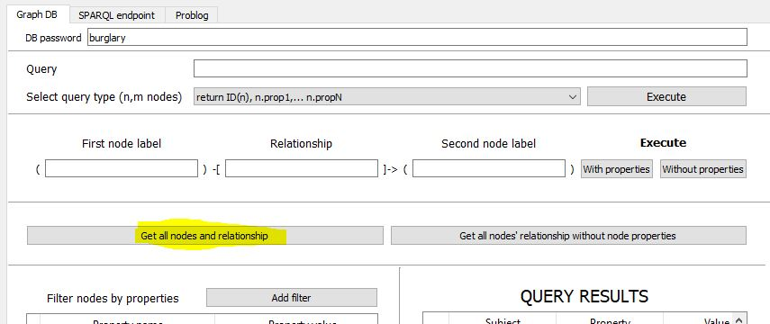
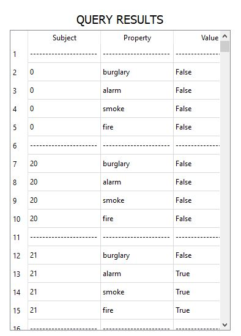
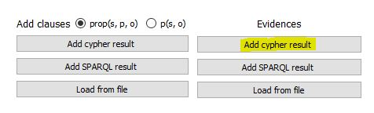
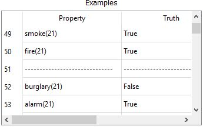
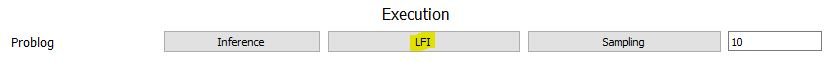

# Calcolo probabilità tramite LFI 

Questo esempio è un' estensione dell'esempio [Bayesan network](https://dtai.cs.kuleuven.be/problog/tutorial/learning/01_bayes.html)

Gli esempi vengono però estratti da un database Neo4j contenente i dati relativi a furti con scasso, incendi e allarmi relativi a 100 notti.

### Query

Il DB è molto semplice, si tratta di un solo tipo di nodo Night con le relative proprietà, quindi possiamo eseguire la query di default:

Il parsing restituirà triple del tipo:

(idnotte, fire, valore)  
(idnotte, alarm, valore)  
(idnotte, smoke, valore)  
(idnotte, burglary, valore)  
...

### Caricamento su problog

Passando al tab "Problog" clicchiamo su:

Viene eseguito un parsing che permette di dare i risultati della query come esempi di input dell'algoritmo LFI di problog

Carichiamo ora la BK necessaria per eseguire l'algoritmo LFI, contenuta nel file [burglary_lfi.pl](https://github.com/pasqualedem/Progetto-ICon1920/blob/master/examples/burglary_lfi.pl)

### LFI

Nella parte sottostante clicchiamo "LFI" e scegliamo dove vogliamo che il file risultante venga salvato.

Il risultato è 
<pre>
0.1::burglary(N).
0.12::fire(N).
0.999999990252684::p_alarm1(N).
0.999999999999978::p_alarm2(N).
0.999999999999979::p_alarm3(N).
0.999999999999988::smoke(N) :- fire(N).
alarm(N) :- burglary(N), fire(N), p_alarm1(N).
alarm(N) :- burglary(N), \+fire(N), p_alarm2(N).
alarm(N) :- \+burglary(N), fire(N), p_alarm3(N).
</pre>
