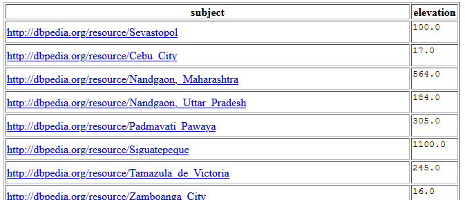
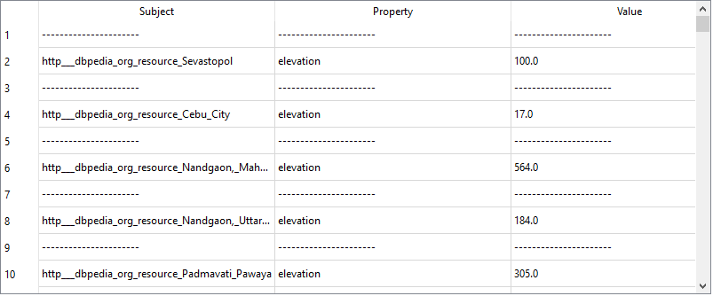
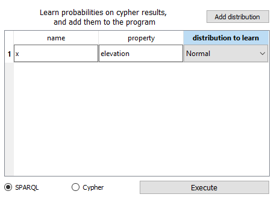
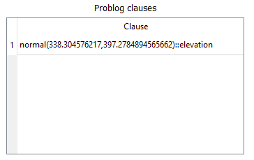
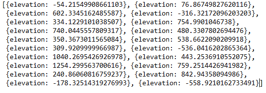
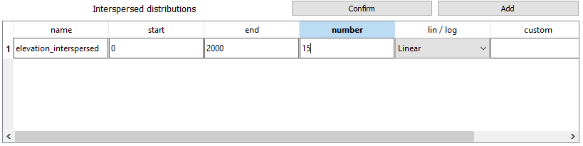
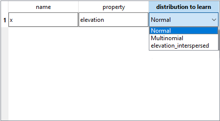

# Calcolo delle distribuzione dell'elevazione delle città e campionamento

In questo esempio, tramite l'endpoint sparql https://dbpedia.org/sparql , è stata eseguita la seguente query:

```
PREFIX dbo: <http://dbpedia.org/ontology/>
PREFIX dbr: <http://dbpedia.org/resource/>

SELECT ?subject, ?elevation 
WHERE {
?subject a dbo:City .
?subject dbo:elevation ?elevation
}
```

Il risultato di tale query è:



Eseguendo la query tramite questo  software, si ha il risultato convertito nella rappresentazione a triple



Passando al tab problog, si utilizza l'operazione di calcolo delle distribuzioni dei dati



Si ottiene una clausola annotata da probabilità espressa come parametri di uan distribuzione normale



A tale clausola si aggiunge la query problog ``` query(elevation). ``` (presente nel file query_elevation.pl); si utilizza il programma problog ottenuto per l'operazione di sampling generando, ad esempio, 20 campioni.



Un'altra possibile operazione, con i risultati della query SPARQL precedentemente esposta, è la costruzione di una disgiunzione annotata tramite il calcolo dei parametri di una distribuzione "intervallata", cioè una particolare multinomiale i cui possibili valori sono intervalli.

Tale operazione si esegue dalla sezione problog, definendo i parametri della distribuzione intervallata



Premendo il pulsante confirm, tale distribuzione descritta sarà disponibile nel menù a scelta multipla che specifica che dsitribuzione apprendere per la proprietà specificata



La disgiunzione annotata ottenuta è:

``` 
0.2588::prop(x,elevation,(0.0, 142.85714285714286]); 
0.0791::prop(x,elevation,(428.57142857142856, 571.4285714285714]); 
0.2857::prop(x,elevation,(142.85714285714286, 285.7142857142857]); 
0.2491::prop(x,elevation,(285.7142857142857, 428.57142857142856]); 
0.0112::prop(x,elevation,(1000.0, 1142.857142857143]); 
0.0075::prop(x,elevation,(2000.0, inf)); 
0.0064::prop(x,elevation,(1571.4285714285716, 1714.2857142857142]); 
0.0096::prop(x,elevation,(1142.857142857143, 1285.7142857142858]); 
0.0344::prop(x,elevation,(571.4285714285714, 714.2857142857143]); 
0.0194::prop(x,elevation,(714.2857142857143, 857.1428571428571]); 
0.0125::prop(x,elevation,(857.1428571428571, 1000.0]); 
0.0077::prop(x,elevation,(1428.5714285714287, 1571.4285714285716]); 
0.0053::prop(x,elevation,(-inf, 0.0]); 
0.0079::prop(x,elevation,(1285.7142857142858, 1428.5714285714287]); 
0.0022::prop(x,elevation,(1857.142857142857, 2000.0]); 
0.0032::prop(x,elevation,(1714.2857142857142, 1857.142857142857]) :- true
``` 
