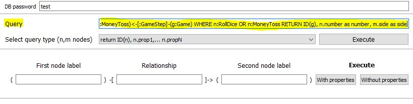
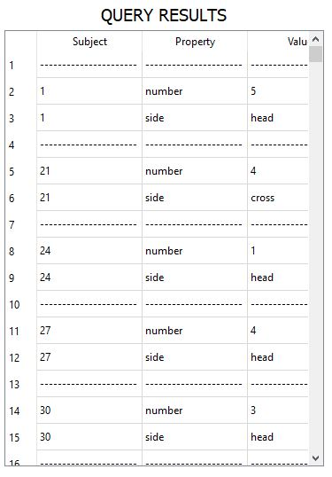

# Calcolo probabilità di vittoria di un semplice gioco

Supponiamo di avere un database Neo4j contenente gli esiti di un semplice gioco:

si vince se tirando un dado si ottiene un numero maggiore di 3, e tirando una moneta si ottiene testa, altrimenti si perde.

Inseriamo la query: 

<b>MATCH (n:RollDice)<-[:GameStep]-(g:Game) MATCH (m:MoneyToss)<-[:GameStep]-(g:Game)  WHERE n:RollDice OR n:MoneyToss RETURN ID(g), n.number as number, m.side as side</b>

la quale restituisce l'id del nodo della giocata il numero ottenuto dal dado, e il lato ottenuto dalla moneta.
Il parsing restituirà triple del tipo:

(idgiocata, number, valore)  
(idgiocata, side, valore)
...

Queste possono essere trasformate in fatti logici nella forma prop(idgiocata, number, valore) oppure nella forma number(idgiocata, valore).

Passando al tab "Problog" inseriamo il soggetto relativo, il nome e il tipo di distribuzioni che vogliamo calcolare:

Eseguendo dovrebbe aver aggiunto le relative clausole Problog.

A questo punto carichiamo il file game_inference.pl il quale contiene la clausola che descrive il funzionamento della vittoria e la clausola contenente la query.

### Inferenza

Nella parte sottostante clicchiamo "inference" e scegliamo dove vogliamo che il file risultante venga salvato.

Il risultato è *{win(game,true): 0.256536}*

### Campionamento

Cliccando invece su Sampling, decidendo il numero di campioni che si vogliono generare, possiamo produrli e scriverli su file.

*[{win(game,true): False}, {win(game,true): False}, {win(game,true): False}, {win(game,true): True}, {win(game,true): False}, {win(game,true): False}, {win(game,true): False}, {win(game,true): True}, {win(game,true): False}, {win(game,true): False}]*

