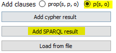
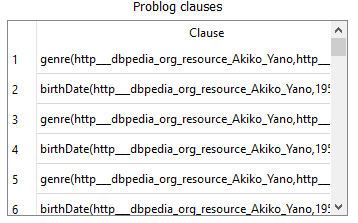
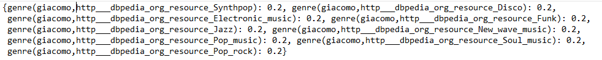

# Esempio inferenza con dati LOD

In questo esempio, tramite l'endpoint sparql https://dbpedia.org/sparql , è stata eseguita la seguente query:
```
PREFIX dbo: <http://dbpedia.org/ontology/>

SELECT ?subject, ?genre, REPLACE(str(?birthDate), "(\\d*)-.*", "$1") AS?birthDate
WHERE {
?subject a dbo:MusicalArtist .
?subject dbo:genre ?genre .
?subject dbo:birthDate ?birthDate .
}
LIMIT 100
```

Tale query, eseguita attraverso questo software viene convertita nella rappresentazione a triple


Utilizzando la sezione problog (con il pulsante in figura), si caricano nel programma tali risultati come clausole rappresentanti fatti:

 



In seguito si aggiungono al programma la clausola, rappresentante il rapporto tra genere suonato e anno di nascita, e una query di esempio. Tali istruzoni sono presenti nel file music.pl.

Eseguendo l'operazione di inferenza si ottiene:


